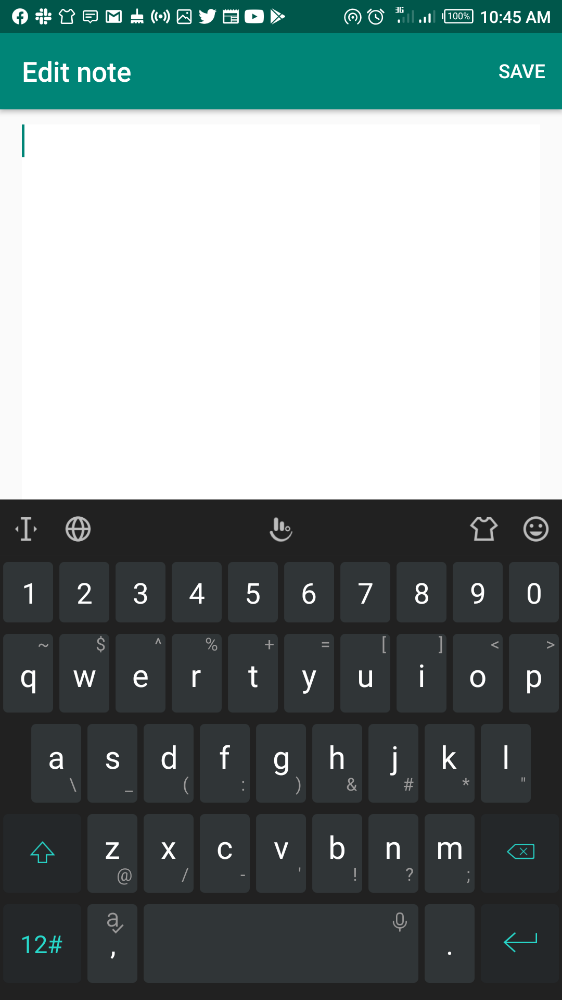
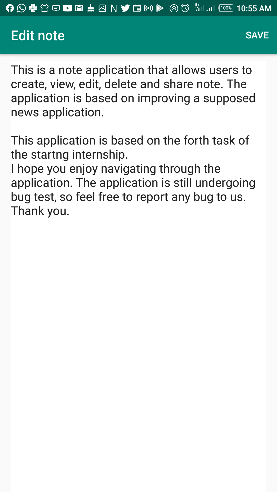
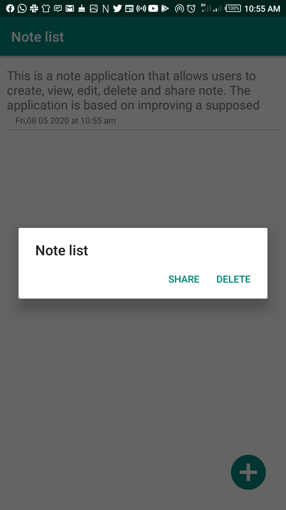
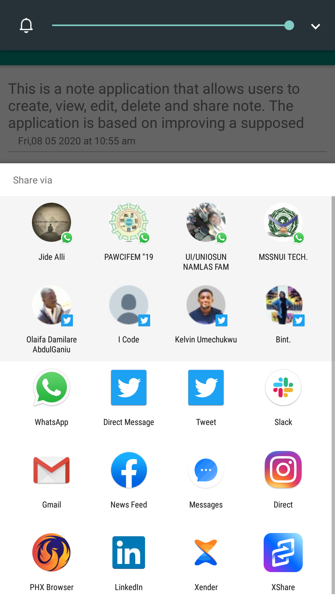
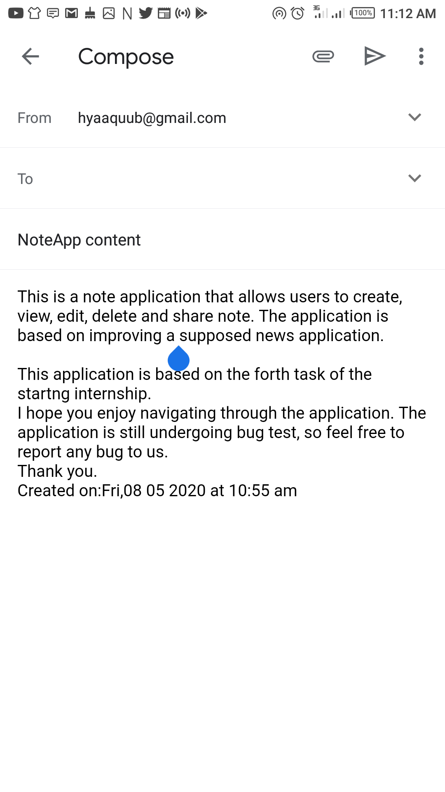

# NewsApp-SNG
This is a basic note application that aloows users to create, edit , view, delete and share note.

This is the laucher activity where users can create new note with the add button, and where users can view their note list

After the add button is tapped,the edit note activity is launched where users can write their note and the
save button on the right corner is tapped to save the note.

