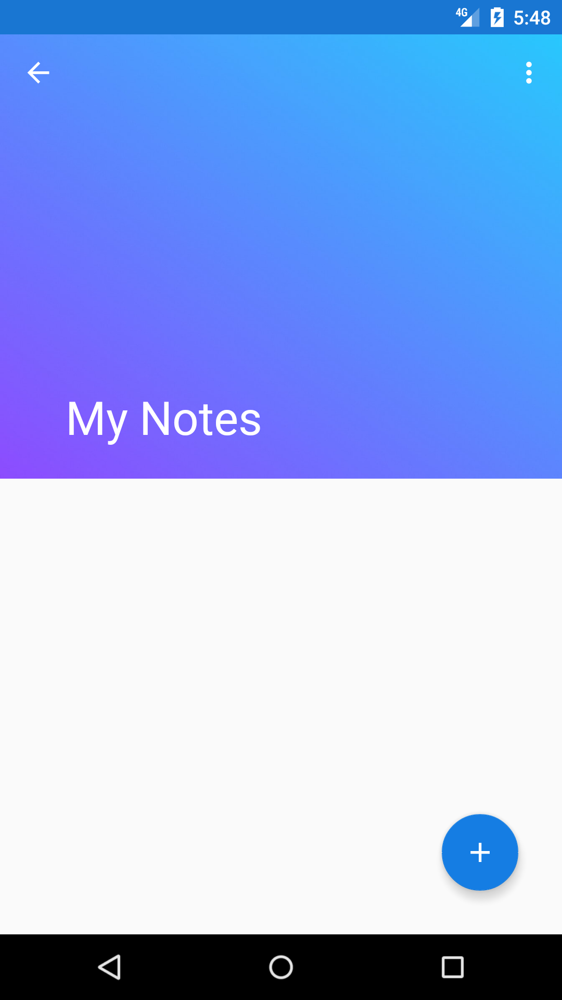
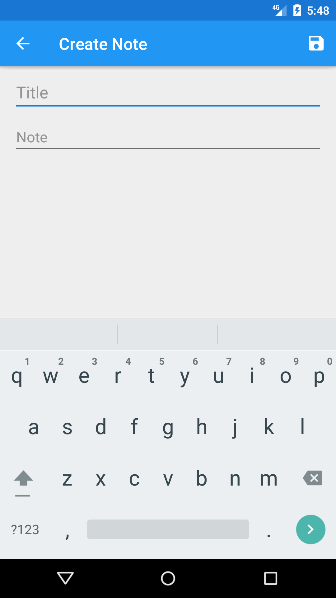
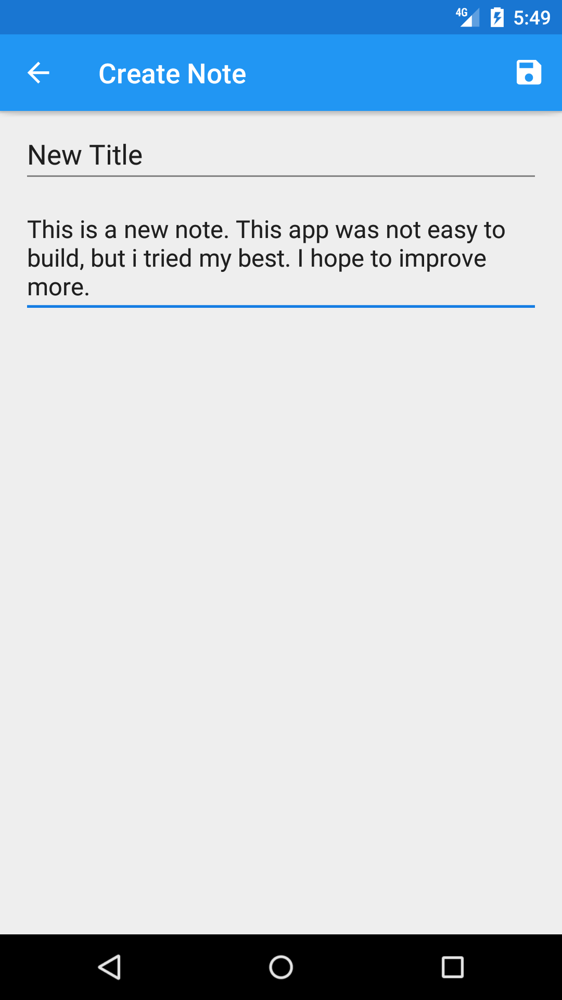
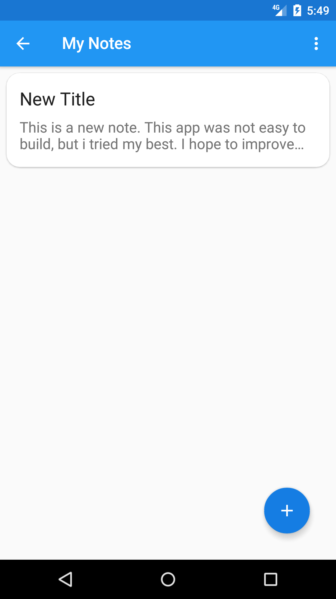
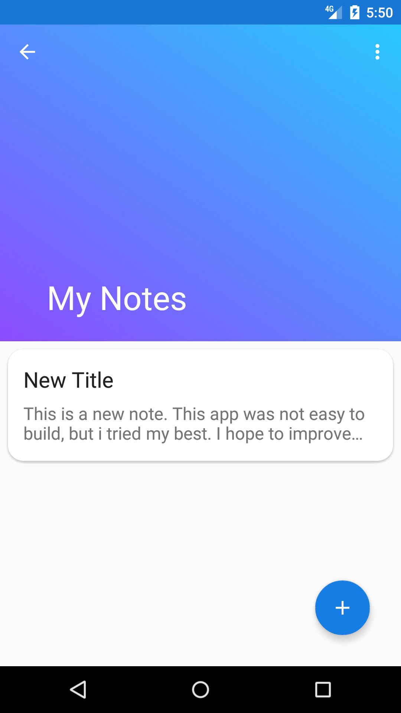
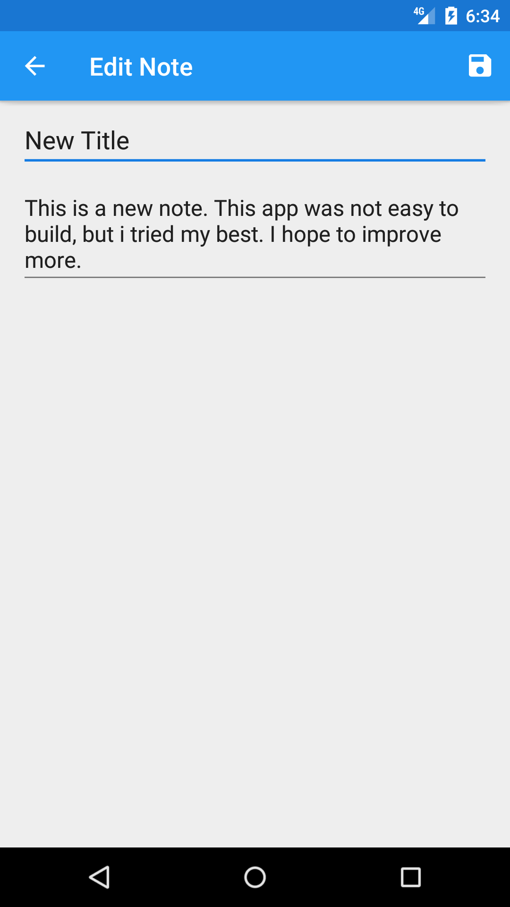
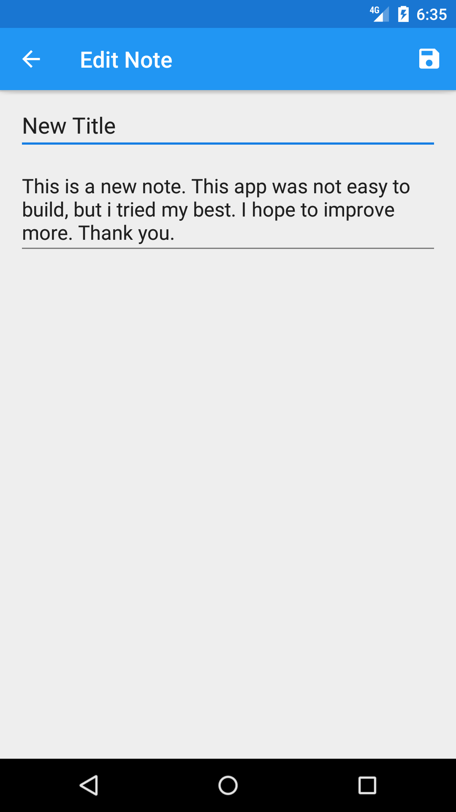

# My Notes App
This is my note app
This is the first activity that opens.
The button is clicked to start creating your notes.

I changed my action bar to a collapsing toolbar which has an overflow menu with an option to delet all your notes and back button to return to the first activity and also a FAB(Floating Action Bar) to add a new note. To delete one app at a time, you can swipe left or right. 

This is my create note activity where you add the title of your note and the content, then save the note.

You can view and edit the notes you made.

