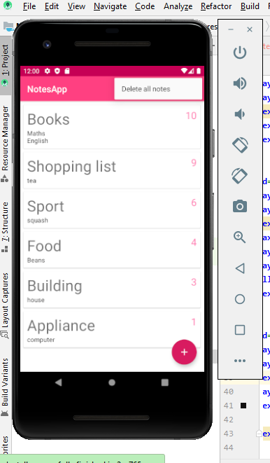

# NoteApp 
A basic app for created using recyclerview,cardview and material design for the UI. 
Architectural components used includes ROOM for database, repository for interaction of UI with the database,
LiveModel for LiveData and Lifecycle.

The NotesApp can <strong>create note</strong>, <strong>delete note</strong>, <strong>edit note</strong> and <strong>delete all notes</strong> together.
A note has a <strong>title</strong>, <strong>description</strong> and <strong>priority</strong>.

<h1>Home screen</h1>
 

<h1>Note content</h1>

<h1>Empty content</h1>

<h1>Swipe to Delete</h1>

<h1>Delete all notes</h1>

